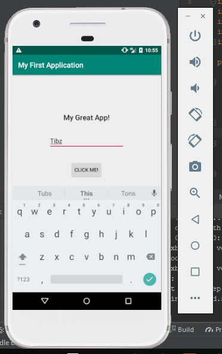
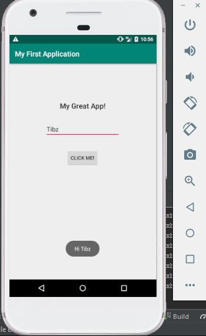

SimpleAndroidApp
===

---

About
---
This is a simple Input/Output application. 
It asks a user to enter a name then it will greet the user with the name he/she entered. 
This greet is a Toast that pops up on the bottom of the screen.

Things used:
---
- Android Studio
- Form factor: Phone and tablet
- SDK: API 15: Android 4.0.3 (IceScreamSandwich)
- Virtual Device properties: 
	1. Nexus 5 (phone)
	2. Lollipop (system image)

Demo
---

- Asking for user input 
	

- Displays greeting 
	
